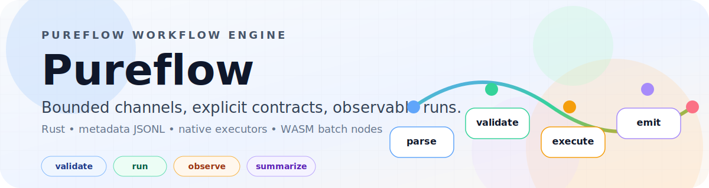

# Pureflow

<p align="center">
  
</p>

Pureflow is an experimental Flow-Based Programming workflow engine written in Rust.
It validates workflow documents, executes node graphs through bounded channels,
and emits machine-facing metadata and run summaries.

The current repository state has a working vertical slice for validated workflow
documents, bounded graph execution, metadata JSONL, native executor registries,
and Wasmtime Component Model batch nodes.

## Why It Is Interesting

- Bounded channels make backpressure visible instead of hiding it.
- Metadata is treated as a first-class artifact, so runs are easier to inspect and explain.
- Native executors and WASM batch nodes share the same graph model.
- The runtime boundary stays narrow: Pureflow owns workflow shape, contracts, ports, metadata, and capabilities.

## Start Here

- Read the human architecture guide in `docs/architecture-guide/` for the why.
- Read `docs/llm/` if you want compact retrieval notes instead of the narrative guide.
- Validate and inspect the sample workflow:

  ```bash
  cargo run -p pureflow-cli -- validate examples/native-linear-etl.workflow.json
  cargo run -p pureflow-cli -- inspect examples/native-linear-etl.workflow.json
  ```

- Run the native linear ETL workflow:

  ```bash
  cargo run -p pureflow-cli -- run examples/native-linear-etl.workflow.json /tmp/pureflow-native-linear-etl.metadata.jsonl
  ```

- Use the Nix devshell for build and test commands:

  ```bash
  nix develop . --command cargo check --workspace --all-targets
  nix develop . --command cargo test --workspace
  ```

## Current Capabilities

- Parse and validate canonical JSON workflow documents with typed diagnostics.
- Inspect workflow topology, contracts, capabilities, enforcement levels, and
  edge capacities as JSON.
- Explain runnable topology and metadata behavior from the CLI.
- Run workflows through a real executor registry backed by bounded async ports.
- Capture lifecycle, message-boundary, queue-pressure, structured error, and
  deadlock metadata as JSONL.
- Emit machine-facing `pureflow run --json` summaries with stable status and
  error fields.
- Execute native nodes and manifest-loaded WASM component nodes in the same
  graph.
- Validate WASM outputs at the host graph boundary before packets enter
  downstream edges.
- Apply Wasmtime fuel limits and cancellation-aware interruption to guest
  invocation.

## Docs

- Human architecture guide: `docs/architecture-guide/`
- LLM retrieval notes: `docs/llm/`
- Workflow run guide: `docs/workflow-run-guide.md`
- Examples catalog: `docs/examples-catalog.md`

The remaining open work is primarily product documentation and release hygiene,
plus deferred data-tier experiments that are intentionally parked until concrete
workloads justify them.

## Repo Layout

- `crates/pureflow-types` - validated identifier primitives
- `crates/pureflow-workflow` - static workflow graph model and validation
- `crates/pureflow-workflow-format` - versioned external workflow format parsing
- `crates/pureflow-core` - runtime-facing traits, ports, metadata, capability, and error types
- `crates/pureflow-contract` - node contract data and validation
- `crates/pureflow-introspection` - pure workflow/contract/capability projections
- `crates/pureflow-runtime` - `asupersync` runtime adapter and node observer boundary
- `crates/pureflow-engine` - workflow orchestration, registry execution, backpressure, policies, and summaries
- `crates/pureflow-wasm` - Wasmtime-backed Component Model batch adapter and WIT boundary
- `crates/pureflow-cli` - validation, inspection, explanation, and run commands
- `crates/pureflow-test-kit` - reusable builders, doubles, and test helpers
- `examples/` - runnable workflow examples
- `docs/` - proposal, epic planning, audit notes, and handoff material

## Build

The project is developed through the Nix devshell so the expected nightly Rust
toolchain and project wrappers are available.

```bash
nix develop . --command cargo check --workspace --all-targets
```

## Test

```bash
nix develop . --command cargo test --workspace
nix develop . --command cargo clippy --workspace --all-targets -- -W clippy::pedantic -W clippy::nursery -W clippy::perf -W clippy::redundant_clone
nix develop . --command cargo fmt --check
nix develop . --command cargo-dylint-nightly --all
```

Use `cargo-dylint-nightly` for the Dylint pass. The devshell now owns the
nightly toolchain and driver wiring for that command directly.

## Examples

Validate, inspect, and explain a workflow:

```bash
cargo run -p pureflow-cli -- validate examples/native-linear-etl.workflow.json
cargo run -p pureflow-cli -- inspect examples/native-linear-etl.workflow.json
cargo run -p pureflow-cli -- explain examples/native-linear-etl.workflow.json
```

Run the native linear ETL topology and write metadata JSONL:

```bash
cargo run -p pureflow-cli -- run examples/native-linear-etl.workflow.json /tmp/pureflow-native-linear-etl.metadata.jsonl
```

Validate a WASM component manifest before running (catches unknown fields,
invalid node IDs, duplicate entries, and unreadable component paths):

```bash
cargo run -p pureflow-cli -- validate-manifest wasm-components.json
```

Pass `--workflow` to also verify that every manifest node exists in the workflow:

```bash
cargo run -p pureflow-cli -- validate-manifest --workflow workflow.json wasm-components.json
```

For the complete WASM smoke path, see `examples/wasm-uppercase.md`.

To load WASM component nodes through the CLI, pass a component manifest to
`run`. Component paths are resolved relative to the manifest file:

```json
{
  "components": [
    {
      "node": "wasm-upper",
      "component": "components/uppercase.wasm",
      "fuel": 100000000
    }
  ]
}
```

```bash
cargo run -p pureflow-cli -- run --wasm-components wasm-components.json workflow.json /tmp/pureflow.metadata.jsonl
```

More examples and command-by-command walkthroughs live in:

- `docs/workflow-run-guide.md`
- `docs/examples-catalog.md`
- `examples/authoring/README.md`
- `examples/workloads/`
- `docs/metadata-json.md`

## Help

Every command has built-in help:

```bash
cargo run -p pureflow-cli -- --help
cargo run -p pureflow-cli -- run --help
```

## Shell Completions

Generate completions for your shell and source them in your shell profile:

```bash
# Bash
cargo run -p pureflow-cli -- completions bash >> ~/.bash_completion

# Zsh
cargo run -p pureflow-cli -- completions zsh > ~/.zfunc/_pureflow

# Fish
cargo run -p pureflow-cli -- completions fish > ~/.config/fish/completions/pureflow.fish
```

Supported shells: `bash`, `zsh`, `fish`, `powershell`, `elvish`.

## Key Docs

- `docs/archetecture/proposal_final.md` - current architecture proposal and roadmap
- `docs/workflow-run-guide.md` - validate, inspect, explain, run, and summary guide
- `docs/examples-catalog.md` - runnable examples and expected outputs
- `docs/schema-generation.md` - JSON Schema generation for workflow documents and WASM component manifests
- `docs/validation-matrix.md` - format, check, test, Clippy, Dylint, and bench gates
- `docs/release-readiness.md` - release candidate checklist and deferred work notes

For the rest, browse `docs/` and `examples/` directly. The repository is the
source of truth.
